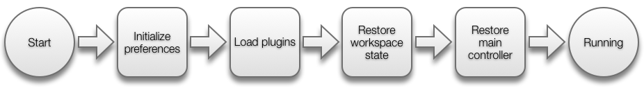
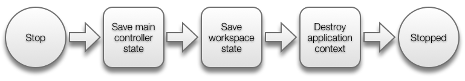
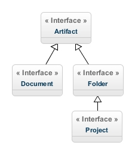
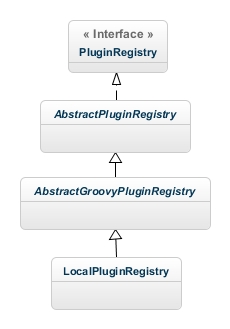

% Shift - Developer guide
% Gilles Grousset
% July 21, 2013

# Getting started


## Required skills

The application is developped using Java and JavaFX, Maven is used for building.

Thereby a good knowledge of Java and Object Oriented Programming is required, as well as Asynchronous Programmation.

## Technical setup and tools

### Java

The required JDK version is 1.7 (a recent official Oracle version with JavaFX 2.2 included but not higher than update 21, because JavaFX has a [bug](https://javafx-jira.kenai.com/browse/RT-32415)). 

However, due to some limitations with Java 1.7, Java 1.8 will be used as soon as it will be available.

The current limitations on Java 1.7 are:

* High-density screens (such as MacBook Pro Retina) are not supported: this results in blurry windows on those screens.
* JavaFX `WebView` does not allow the change of the user agent: this could be a limitation for previewing HTML pages in the future.

### Maven

Maven 3 and the [javafx-maven-plugin](https://github.com/zonski/javafx-maven-plugin) are used to run and package the application.

When using the plugin form the first time, remember to fix your current JRE classpath with the folling command:

```
mvn jfx:fix-classpath
```


### IDE

Any IDE can be used for development, however Netbeans is recommended as it has the best JavaFX support at the moment.

## Building from sources

### Running the application

In order to run the application use:

```
mvn jfx:run
```

### Packaging the application

Packaging means : building the application and a native installer for it. The format depends on the operating system and additional tools may be installed prior to creating the package. 

Read [Building a Native Installer](http://zenjava.com/javafx/maven/native-bundle.html) for more information.

The command for packaging is:

```
mvn clean jfx:native
```

## Conventions

### Coding conventions

Generic Oracle Java conventions are used for the project: [Code Conventions for the Java TM Programming Language](http://www.oracle.com/technetwork/java/javase/documentation/codeconvtoc-136057.html)

### Naming conventions

#### FXML

FXML files are located into `fxml` resource package and named using the underscore convention.

FXML file name must be the same as its controller class.

For example, the FXML file name for `HTMLPreviewController`is `html_preview.fxml`

#### CSS

CSS class names must use dashes and ids use the CamelCase.

Example:

```
#projectNavigator {
	...
}

.text-input .invalid {
	...
}
```

## Overview & concepts

### Model and managers

The application is built around code editor / IDE core concepts:

* **Workspace**: the place where every artifact lives. An artifact can be any piece of data that can be edited or created from the application : a project is an artifact, a folder or a source file is also an artifact.
* **Preferences**: a centralized way to manage application settings / preferences.
* **States**: the ability to save and restore and object state upon application restart.
* **Tasks**: task queue to mange asynchronous operations.
* **Plugins**: to make the application extensible.
* **Themes**: look and feel management.


### GUI

The user interface (GUI) is built upon (in a same main window):

* **Menu**: application main menu.
* **Project navigator**: tree navigation into the workspace and interactions with it.
* **Editors pane**: holds tabs for documents opened into editors.
* **Status bar**: gives information about task being performed, current document…

Child windows can be opened from the main windows, such as : preview windows, wizard windows, new file / folder window…

## Application lifecycle

The application is started by the `com.backelite.shift.MainApp` class (`start(…)` method).
When it is shuting down, the method `stop(…)`of the same class is called.

### Startup sequence



When starting, the application first initializes preferences: it checks if all required settings are set (and set them with a default value if they aren't). See [Preferences](#preferences) section for more information.

After that it loads plugins. See [Plugins](#plugins) section for more information.

Then it restores the workspace state. See [States](#states) section for more informations.

And finally, it brings up the main window interface and restore its state as well.

### Shutdown sequence



At shutdown, the workspace state is saved, the main controller state is saved and the `ApplicationContext` is destroyed.


### ApplicationContext

`com.backelite.shift.ApplicationContext` is the main entry point to access application centralized components.

It acts as a holder for storing singleton instances of application components, such as the workspace, the plugin manager, …

For example, it is possible to access the plugin manager like this from anywhere in the application:

```java
ApplicationContext.getPluginManager();
```

# The workspace

Classes related to the workspace are located in `com.backelite.shift.workspace`.

The workspace is represented by the `Workspace` interface. The default workspace implementation is `LocalWorkspace`. 

This implementation manages artifacts from the local file system.

`Workspace` extends the `PersistableState` interface in order to be able to save / restore the current workspace on application exit / restart.

The application only holds one workspace (singleton). It can be accessed using `com.backelite.shift.ApplicationContext` static method: 

```java
ApplicationContext.getWorkspace();
```

## HTTP Proxy

When required (usually by previewers), the `HTTPWorkspaceProxyServer` (singleton) can be started in order to serve workspace artifacts on the HTTP protocol.

The HTTP proxy can be accessed using `com.backelite.shift.ApplicationContext` static method: 

```java
ApplicationContext.getHTTPWorkspaceProxyServer();
```

It can be started like this (ignored if the server is already started): 

```java
ApplicationContext.getHTTPWorkspaceProxyServer().start();
```

It can be stopped with (automatically stopped at application shutdown): 

```java
ApplicationContext.getHTTPWorkspaceProxyServer().stop();
```

The port of the server is determined at runtime (on start) depending on port number availability (see `com.backelite.shift.util.NetworkUtil.findAvailablePort(…)` for more information).

## Artifacts

Classes related to workspace artifacts are located in `com.backelite.shift.workspace.artifact`.



`Artifact` interface is the most basic representation of a workspace item. An artifact can be (at the moment) a `Project`, a `Folder` or a `Document` (interfaces).

`Project` interface inherits the `Folder` interface: a project is a folder with extra attributes and features.

Concrete implementations of those artifacts are `FileSystemProject`, `FileSystemFolder` and `FileSystemDocument`.

> *Note: a file is referred as a `Document` artifact to avoid the confusion with `java.io.File`, in the GUI layer however it is designated as file to follow editors / IDE conventions.*

## Observing the workspace

In order to make the GUI reflect workspace updates (new folder created, document modified…), every `Workspace` or `Artifact` implementation is observable which mean that they inherit `fr.grousset.util.WeakObservable` object.

`WeakObservable` is an enhanced implementation of the original [`java.util.Observable`](http://docs.oracle.com/javase/7/docs/api/java/util/Observable.html) but that does not require to unregister observers as they are kept as weak references.

For instance, when a GUI controller needs to be notified of an artifact update it only needs to implements the `java.util.Observer` interface and register itself as observer on the artifact:

```java
document.addObserver(this);
```

When implementing `java.util.Observer` interface, the following method needs to be defined in order to receive update notifications: 

```java
public void update(Observable o, Object arg) {
  // Handle change here
}
```

### Artifact case

In the artifact case, the `Observable` object is the artifact that was updated (the source) and the arg `Object` (not always defined) is the original source.

For example, the original source is set in case of a `Document` artifact : when it changes, it notifies its observers, but also triggers a notification from its parent folder.

When a `Folder` receives a notification, it forwards the notification with the original source to its observers (at least its parent folder, a `Folder` always observes its children).

Here are practical cases :

Observed artifact | Modified artifact            | Observable parameter received | arg Object parameter received
 -----------------|----------------------------- | ------------------------------|------------------------------
Document          | same Document                | Document                      | null
Folder / Project  | same Folder / Project        | Folder / Project              | null
Folder / Project  | child or grand-child Document| Folder / Project              | child or grand-child Document
Folder / Project  | child or grand-child Folder  | Folder / Project              | child or grand-child Folder


### Workspace case

In the workspace case it is simplier: the `Observable` object is always the `Workspace` and the arg `Object` is always the `Project` that was modified.

### Knowing what changed on the observable

When `java.util.Observer.update(…)` method is called it is possible to know which artifact changed, but not directly what changed.

To do so, here are some snippet to detect changes:

* `Document` was modified

```java
public void update(Observable o, Object arg) {
        
        // A document was updated
        if (o instanceof Document) {
        	Document document = (Document)o;
        	if (document.isModified()) {
        		// Handle change here
        	}
        }
}
```

* `Document` or `Folder` was deleted

```java
public void update(Observable o, Object arg) {
        
        // An artifact was updated
        if (o instanceof Artifact) {
        	Artifact artifact = (Artifact)o;
        	if (artifact.isDeleted()) {
        		// Handle change here
        	}
        }
}
```

* `Project` was closed

```java
public void update(Observable o, Object arg) {
        
        // A project was updated
        if (o instanceof Workspace) {
        	Project project = (Project)arg;
        	if (!ApplicationContext.getWorkspace().getProjects().contains(project) {
        		// Handle change here
        	}
        }
}
```

# Managers

This part deals with services / managers common to the whole application.

## Preferences

Preferences are used to manage application settings across the application.

Classes related to preferences are located inside `com.backelite.shift.preferences`.

The heart of the preferences system is the `PreferencesManager`interface: it defines methods to store and retrieve preferences (`setValue(…)`, `getValue(…)`).


The default (and unique) implementation of `PreferencesManager`, at the moment, is `LocalPreferencesManager`: this implementation is designed to store preferences as a JSON file *preferences.json* in a local directory.

### Transactions

`PreferencesManager` is transactionnal, which means that the `commit()`method must be called to persist modifications. If modifications must be reverted to the last commit, the method `rollback()` can be used.

A singleton `PreferencesManager`instance is used for the whole application and can be accessed from the `ApplicationContext`:

```java
PreferencesManager preferencesManager = ApplicationContext.getPreferencesManager();
// Set an initial value
preferencesManager.setInitialValue("key", "value");            
// Set a value
preferencesManager.setValue("key2", "value2");      
preferencesManager.commit();

// Read a value
String value = (String)preferencesManager.getValue("key3");
```

### Setting initial values

When the application (or a plugin) starts form the first time: it needs to set initial values into preferences, but must no erase existing values if they are already set.

To do so, the `PreferencesManager` exposes the `setInitialValue(…)`(to set a single value) and `setInitialValues(…)` (to set several values at the same time).

When the application starts it checks and initializes initial values with thoses methods. The code is located inside `com.backelite.shift.MainApp.initializePreferences()` and it is called from `com.backelite.shift.MainApp.start(…)`. 

See [Application lifecycle](#application-lifecycle) for more informations about the application startup sequence.


## States

States are used to save and restore application components states between application restarts.

Classes relating to states management are located inside `com.backelite.shift.state`.

Any object of the application can be persisted, it just needs to implement the `PersistableState` interface.

`PersistableState` objects can then be handled by a `StateManager` (interface). The `StateManager`is in charge of serializing and deserializing states to a storage device.

The default (and only one at the moment) concrete implementation of `StateManager` is the `LocalStateManager`: an implementation that stores states as JSON files into a directory.

The default instance of the `StateManager` can be accessed from the `ApplicaitonContext`:

```java
ApplicationContext.getStateManager();
```

### Saving state

Saving a state consists of populating a `Map<String, Object>` object with all the values required to restore the current object state:

```java
public void saveState(Map<String, Object> state) throws StateException {

        state.put("value1", this.value1);
        state.put("value2", this.value2);
        ...
}
```

### Restoring state

Restoring a state consists of reading a `Map<String, Object>` object in order to restore the current object state:

```java
public void restoreState(Map<String, Object> state) throws StateException {

	String value1 = (String)state.get("value1");
	String value2 = (String)state.get("value2");
	...
}
```

### Instances identification

The `PersistableState`interface provides a method named `getInstanceIdentifier()` and is used to identify a given object instance.

If this method returns `null`, a single state is maintianed for all instances of the class. For example, with the `LocalStateManager` saving an object called `MyObject` without providing an identifier will result into a state file name `myobject.json`.

However, if the `getInstanceIdentifier()` returns a value, a state will be maintaned for every instance of the class. In the case of the `LocalStateManager`the state file name for a given instance of `MyObject` will be named `myobjectMYID.json` (where *MYID* is the identifier returned by the instance).

## Tasks

Tasks are used in the application to handle asynchronous processing. They are commonly used to handle time consuming operations without blocking the user interface.

Class relating to tasks and task management are located inside the `com.backelite.shift.task`.

Tasks used are common `javafx.concurrent.Task` objects. There are processed by a `TaskManager`.

The `TaskManager` holds a task queue where new tasks can be added. The sate of a `TaskManager`can be listened by adding a `TaskManagerListener` on it.

The default concrete implementation of `TaskManager`is `LocalTaskManager`.

### Shared TaskManager

A shared `TaskManager` can be accessed using `com.backelite.shift.ApplicationContext` static method:

```java
ApplicationContext.getTaskManager();
```

This `TaskManager`must be used as much as possible to run tasks: as the central `TaskManager`it is linked to the [Status bar GUI element](#status_bar) and state (name and progress) of the current running task is displayed on it.

### Creating a TaskManager

If for some reasons, a task needs to run outside the sahre `TaskManager` (to run a background download without preventing the user to work), it is possible to create a `LocalTaskManager` like this (usually in a controller class):

```java
TaskManager taskManager = new LocalTaskManager();
```

### Creating a new task

Adding a task to a `TaskManager` can be done like this:

```java
ApplicationContext.getTaskManager().addTask(new Task() {
	@Override
    protected Object call() throws Exception {
    	
    	// Set title
        updateTitle("task title");
        
        // Let's say the process iterates over an item array
        for (int i = 0; i < 10; i++) {
           		
        	// Process item here…
           	…
           		
            // Update progress
   	       	updateProgress(i + 1, 10);
       	}
   		
        // Return anything…
        return true;
               
	}
});
```

The `updateTitle(…)` method can be called to give the task a name. If the shared `TaskManager`is used, this name will be displayed in the status bar while the task is running.

The `updateProgress(…)` gives the ability to track the task progress. Once again: if the shared `TaskManager`is used, the progress will be displayed as a progress bar in tge status bar while the task is running.

### Listening to a TaskManager

A `TaskManager`can be listen to by implementening the `TaskManagerListener`, and registering the listener on the `TaskManager`.

A `TaskManagerListener` gets notified when:

* A task is started
* A task succeeded
* A task failed

Here is an example showing how to create a task and know when it has completed:

First register the current class as listener with:

```java
ApplicationContext.getTaskManager().addListener(this);
```

Then, create the task and add it to the manager (and keep it in a variable):

```java
Task myTask = new Task() {…};
ApplicationContext.getTaskManager().addTask(myTask);
```

Finally in the `onTaskSucceeded(…)` method, intercept the task:

```java
public void onTaskSucceeded(Task task) {
	if (task == myTask) {
		// Do whatever you want here
		...
	}
}
```


## Plugins

As many code editors / IDE these days, many features of the application are provided by plugins.

At the moment, a plugin can provide the following items: 

* **Editors**: editors are pieces of GUI that allow the display and modification of document artifact (source code, image or any other resource file).
* **Wizards**: wizards are pieces of GUI used to control code / files generation. Example : a HTML project wizard provides GUI and code to generate an initial HTML project structure.
* **Previews**: previews are pieces of GUI in charge of rendering a document or project.

Classes related to plugins are located inside the `com.backelite.shift.plugin` package.

Plugins (plugin declarations) are represented by the `Plugin` class. They are held into a `PluginRegistry`.

At the moment, plugin declarations have to be written in [Groovy](http://groovy.codehaus.org/) JVM language.

The default implementation of `PluginRegistry` is `LocalPluginRegistry`. The `LocalPluginRegistry` loads plugin definitions from a local directory.



`AbstractPluginRegistry` is the base implementation class. However, to leave the possibility to support other languages than Groovy for plugin declaration in the future, Groovy releated code is encapsulated inside the `AbstractGroovyPluginRegistry`.

The singleton instance of the `PluginRegistry` can be accessed from the `com.backelite.shift.ApplicationContext` this way:

```java
ApplicationContext.getPluginRegistry();
```

### Plugins loading

Plugins are loaded at application startup as explained in [Application lifecycle](#application-lifecycle).

Loading plugins involves:

* Loading the built-in plugin
* Loading external plugins

The built-in plugin is a plugin embedded into the application to provide initial editors, wizards and previews. Its declaration file is `Builtin.groovy`, located at the root of the resources directory.

> *Note: at the moment, the external plugin loading feature is not implemented and the `PluginManager` loads the built-in plugin only.*


### Groovy DSL (declaration)

A plugin is declared using a Groovy file, and can define the following:

* Plugin general info: such as identifier, name, version…
* Lifecycle event listeners
* Editor factories
* Preview factories
* Project wizard factories

A Groovy DSL (Domain Specific Language) is used for the declaration. The definition, validation and parsing of this DSL is perfomred by the [MetaBuilder Groovy library](http://docs.codehaus.org/display/GROOVY/MetaBuilder).

The *MetaBuilder* works with a model declaration schema (like a XSD for an XML file) using a DSL itself. The schema file is located at the root of the resources directory and is named `PluginSchema.groovy`.

Here is the file (this may evolve in time to support new features):

```java
import groovytools.builder.MetaBuilder

def metaBuilder = new MetaBuilder(getClass().getClassLoader())
			
metaBuilder.define {
    plugin(factory: com.backelite.shift.plugin.Plugin) {
        properties {
            uid(req: true)
            name(req: true)
            description(req: false)
            author(req:false)
            versionCode(req: true)
            versionName(req: true)
            lifecycle(req: false, schema: 'lifecycle')
        }
        collections {
            editorFactories {
                editorFactory(schema: 'editorFactory')
            }
            previewFactories {
                previewFactory(schema: 'previewFactory')
            }
            projectWizardFactories {
                projectWizardFactory(schema: 'projectWizardFactory')
            }
        }
    }
    
    editorFactory(factory: com.backelite.shift.plugin.GroovyEditorFactory) {
        properties {
            name(req: true)
            description(req: true)
            supportedExtensions(req: true)
            code(req: true)
        }
    }
    
    previewFactory(factory: com.backelite.shift.plugin.GroovyPreviewFactory) {
        properties {
            name(req: true)
            description(req: true)
            supportedExtensions(req: true)
            code(req: true)
        }
    }
    
    projectWizardFactory(factory: com.backelite.shift.plugin.GroovyProjectWizardFactory) {
        properties {
            name(req: true)
            description(req: true)
            code(req: true)
            projectGenerator(req: true, schema: 'projectGenerator')
        }
    }
    
    projectGenerator(factory: com.backelite.shift.plugin.GroovyProjectGenerator) {
        properties {
            code(req: true)
        }
    }
    
    lifecycle(factory: com.backelite.shift.plugin.GroovyPluginLifecycle) {
        properties {
            onLoad(req: false)
        }
    }
}

return metaBuilder
```

### Editors

Editors are the corner stone of the application: they provide a UI component to view and edit workspace documents.

To declare a new editor type in a plugin declaration file, a factory closure must be provided. Here is an example to declare a HTML editor (taken from `BuiltinPlugin.groovy`):

```java
 editorFactory {
 	name = "HTML editor"
    description = "Builtin HTML editor"
    supportedExtensions = ['html']
    code = {document, loader ->   
 		Node node = (Node) loader.load(getClass().getResourceAsStream("/fxml/code_editor.fxml"))
        CodeEditorController controller = (CodeEditorController) loader.getController()
        controller.setDocument(document)
        controller.setMode(CodeEditorController.Mode.HTML)
        return node
    }
}
```

An editor factory must define 5 blocks:

1. *name*: the name of the editor type 
2. *description*: the description of the editor type
3. *supportedExtensions*: array containing file extensions the editor applies to
4. *code*: the factory code to build the editor given a context `com.backelite.shift.workspace.artifact.Document` instance and a `javafx.fxml.FXMLLoader`, it must return a `javafx.scene.Node`.

The controller bound to the `javafx.scene.Node` built by the factory must implement the `EditorController` interface.

The factory is called to build an editor when it is requested by the `EditorsPaneContoller.openDocument(…)`.

The choice of the editor to build is made by the `PluginRegistry` in the `newEditor(…)` method: this method looks at the current document extension and finds the first matching editor in the registry.

To make sure, an editor can be found even if the file extension is not supported, a basic text editor is declared into the built-in plugin and uses a wildcard in *supportedExtensions* array:

```java
 editorFactory {
 	name = "Generic text editor"
    description = "Builtin Text editor"
    supportedExtensions = ['*']
    code = {document, loader ->   
    	Node node = (Node) loader.load(getClass().getResourceAsStream("/fxml/code_editor.fxml"))
        CodeEditorController controller = (CodeEditorController) loader.getController()
        controller.setDocument(document)
        return node
 	}
}
```

### Project wizards

TODO

### Previews

TODO

## Themes

TODO

# User interface

## General notice on object cleanup and memory leaks

Explain how to cleanup a dialog controller (ovveride 'close')/ component (implement a 'dispose')

## AbstractController and AbstractDialogController

TODO

## Main window

TODO

### Menu

TODO

### Project navigator

TODO

### Editors pane

TODO

### Status bar

TODO

## Validation

Unfortunately, JavaFX does not provide any input validation system at the time. That is why the application uses its own.

Classes related to validation are located in `com.backelite.shift.gui.validation`.

The validation mechanism is pretty basic: it exposes a `Validator` interface with a single `validate(…)` method and a set of implementations to perform common validations : not blank, filename…

Validators are used in [Custom controls](#custom-controls).

### CompoundValidator

The `CompoundValidator` is a special validator that can run several validators at the same time. It can be built like this:

```java
Validator validator = new CompoundValidator(new NotBlankValidator(), 
new FilenameValidator());
```

### Validation result

The `validate(…)` method of `Validator`interface returns a `ValidatorResult` object. This object is composed of a `valid` attribute and a list of error messages (many messages can be returned with the `CompoundValidator`).

Error messages are simple strings formatted as property key, so that it can be localized in a properties file. Example: the `NotBlankValidator` returns the following message: *validator.not.blank*.


## Custom controls

TODO


